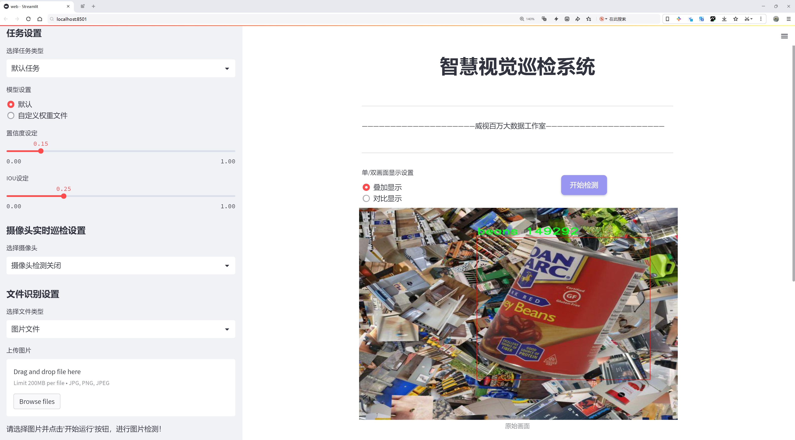
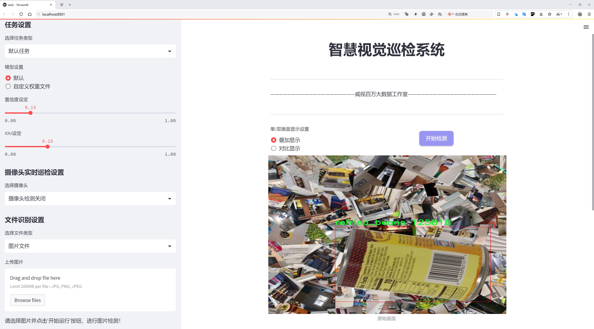
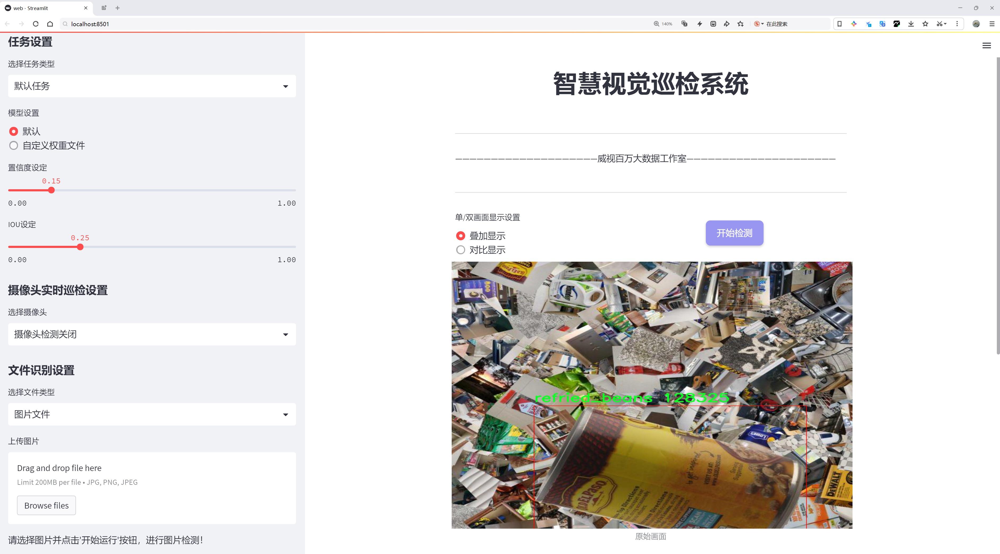

# 罐装食品检测检测系统源码分享
 # [一条龙教学YOLOV8标注好的数据集一键训练_70+全套改进创新点发刊_Web前端展示]

### 1.研究背景与意义

项目参考[AAAI Association for the Advancement of Artificial Intelligence](https://gitee.com/qunmasj/projects)

项目来源[AACV Association for the Advancement of Computer Vision](https://github.com/qunshansj/good)

研究背景与意义

随着全球食品工业的快速发展，罐装食品因其便捷性和长保质期而受到越来越多消费者的青睐。然而，罐装食品的生产和销售过程中，确保产品质量和安全性是至关重要的。传统的人工检测方法不仅耗时耗力，而且容易受到人为因素的影响，导致检测结果的不准确性。因此，基于计算机视觉的自动化检测系统应运而生，成为提升罐装食品检测效率和准确性的有效手段。

近年来，深度学习技术的迅猛发展为目标检测领域带来了革命性的变化。其中，YOLO（You Only Look Once）系列模型因其高效的实时检测能力而广泛应用于各类物体检测任务。YOLOv8作为该系列的最新版本，具备更强的特征提取能力和更快的推理速度，适合在复杂的环境中进行快速、准确的物体识别。因此，基于改进YOLOv8的罐装食品检测系统的研究具有重要的理论价值和实际意义。

本研究所使用的数据集包含6600张图像，涵盖了四类罐装食品：豆类、橄榄、再制豆类和番茄。这些类别的选择不仅反映了市场上常见的罐装食品类型，也为模型的训练提供了丰富的样本。在数据集的构建过程中，确保了图像的多样性和代表性，以便模型能够在不同的环境和条件下进行有效的学习和识别。通过对这些数据的深入分析，可以发现不同类别罐装食品在外观特征上的差异，为后续的模型改进提供了依据。

改进YOLOv8模型的研究将集中在提高其对罐装食品的检测精度和鲁棒性上。通过引入数据增强技术、优化网络结构和调整超参数等手段，期望在保持高检测速度的同时，显著提升模型在复杂背景下的识别能力。此外，结合迁移学习的方法，可以有效利用已有的预训练模型，加速模型的收敛速度，提高检测效果。这些改进不仅有助于提升罐装食品的检测准确率，也为其他食品检测领域的研究提供了借鉴。

从社会意义上看，基于改进YOLOv8的罐装食品检测系统的研究将为食品安全监管提供强有力的技术支持。通过自动化检测系统的应用，可以大幅度降低人工检测的成本，提高检测效率，确保消费者能够获得安全、优质的食品。同时，该系统的推广应用将推动食品行业的智能化发展，促进相关技术的创新与进步。

综上所述，基于改进YOLOv8的罐装食品检测系统的研究不仅具有重要的学术价值，还对实际应用具有深远的影响。通过对该系统的深入研究与开发，将为提升罐装食品的质量安全水平、推动食品行业的智能化转型做出积极贡献。

### 2.图片演示







##### 注意：由于此博客编辑较早，上面“2.图片演示”和“3.视频演示”展示的系统图片或者视频可能为老版本，新版本在老版本的基础上升级如下：（实际效果以升级的新版本为准）

  （1）适配了YOLOV8的“目标检测”模型和“实例分割”模型，通过加载相应的权重（.pt）文件即可自适应加载模型。

  （2）支持“图片识别”、“视频识别”、“摄像头实时识别”三种识别模式。

  （3）支持“图片识别”、“视频识别”、“摄像头实时识别”三种识别结果保存导出，解决手动导出（容易卡顿出现爆内存）存在的问题，识别完自动保存结果并导出到tempDir中。

  （4）支持Web前端系统中的标题、背景图等自定义修改，后面提供修改教程。

  另外本项目提供训练的数据集和训练教程,暂不提供权重文件（best.pt）,需要您按照教程进行训练后实现图片演示和Web前端界面演示的效果。

### 3.视频演示

[3.1 视频演示](https://www.bilibili.com/video/BV1husse3Euj/?vd_source=ff015de2d29cbe2a9cdbfa7064407a08)

### 4.数据集信息展示

数据集信息展示

本数据集名为“罐装食品”，专为改进YOLOv8的罐装食品检测系统而设计，旨在为计算机视觉领域的研究人员和开发者提供高质量的训练数据。该数据集包含6600张图像，涵盖四个类别，分别是：豆类、橄榄、再煮豆和番茄。这些类别代表了常见的罐装食品，具有相似的外观特征，因此为目标检测模型的训练提供了丰富的挑战。

在数据集的构建过程中，我们特别注重图像的多样性和真实性。所有训练图像均在我们位于佛罗里达的摄影工作室拍摄，使用真实的物理对象进行成像。为了确保模型能够准确识别不同类型的罐装食品，我们采用了360度的水平旋转拍摄方式，每9度拍摄一次，确保从各个角度捕捉到物体的细节。此外，每个物体还使用了三种不同的光照条件进行拍摄，包括左侧光、右侧光和正面光，以模拟不同的实际环境。

为了消除背景对分类器决策的影响，我们在数据集中使用了完全随机生成的背景。这一创新方法不仅消除了背景偏差的可能性，还增强了模型在真实场景中的适应能力。数据集中的图像经过了多种增强处理，包括随机旋转、随机定位、随机缩放、对比度调整、引入高斯模糊、随机丢失颜色通道等。这些增强技术的应用使得数据集在视觉上呈现出多样性，帮助模型更好地学习和泛化。

值得一提的是，每个类别中上传了1600张以上的不同图像，确保每个类别的样本量充足，从而提高模型的训练效果。数据集的预处理和增强过程是透明的，用户可以通过“数据集洞察”文件轻松了解每张图像的来源、角度和所应用的增强技术。这种透明性使得用户在训练分类器时能够灵活调整数据集，以达到更高的准确性。

数据集的许可采用CC BY 4.0，允许用户在遵循相应条款的前提下自由使用和修改数据集。这为研究人员和开发者提供了更大的灵活性，促进了学术界和工业界的合作与创新。

总之，Vizonix团队致力于创建高质量的、具有实际应用价值的数据集，以支持计算机视觉领域的研究和开发。我们的“罐装食品”数据集不仅在数量上满足训练需求，更在质量和多样性上为目标检测模型的提升提供了坚实的基础。通过不断的创新和优化，我们希望能为用户提供最佳的使用体验，助力他们在罐装食品检测系统的开发中取得成功。


### 5.全套项目环境部署视频教程（零基础手把手教学）

[5.1 环境部署教程链接（零基础手把手教学）](https://www.ixigua.com/7404473917358506534?logTag=c807d0cbc21c0ef59de5)


[5.2 安装Python虚拟环境创建和依赖库安装视频教程链接（零基础手把手教学）](https://www.ixigua.com/7404474678003106304?logTag=1f1041108cd1f708b01a)

### 6.手把手YOLOV8训练视频教程（零基础小白有手就能学会）

[6.1 环境部署教程链接（零基础手把手教学）](https://www.ixigua.com/7404477157818401292?logTag=d31a2dfd1983c9668658)

### 7.70+种全套YOLOV8创新点代码加载调参视频教程（一键加载写好的改进模型的配置文件）

[7.1 环境部署教程链接（零基础手把手教学）](https://www.ixigua.com/7404478314661806627?logTag=29066f8288e3f4eea3a4)

### 8.70+种全套YOLOV8创新点原理讲解（非科班也可以轻松写刊发刊，V10版本正在科研待更新）

由于篇幅限制，每个创新点的具体原理讲解就不一一展开，具体见下列网址中的创新点对应子项目的技术原理博客网址【Blog】：


[8.1 70+种全套YOLOV8创新点原理讲解链接](https://gitee.com/qunmasj/good)

### 9.系统功能展示（检测对象为举例，实际内容以本项目数据集为准）

图9.1.系统支持检测结果表格显示

  图9.2.系统支持置信度和IOU阈值手动调节

  图9.3.系统支持自定义加载权重文件best.pt(需要你通过步骤5中训练获得)

  图9.4.系统支持摄像头实时识别

  图9.5.系统支持图片识别

  图9.6.系统支持视频识别

  图9.7.系统支持识别结果文件自动保存

  图9.8.系统支持Excel导出检测结果数据


### 10.原始YOLOV8算法原理

原始YOLOv8算法原理

YOLOv8作为2023年1月由Ultralytics发布的最新目标检测模型，标志着YOLO系列算法的又一次重大飞跃。它不仅集成了前几代YOLO模型（如YOLOv5、YOLOv6、YOLOv7）以及PP-YOLOE等先进设计的优点，还在多个方面进行了创新和优化，使其在目标检测的精度和速度上达到了新的高度。YOLOv8的设计理念源于对实时目标检测的深刻理解，旨在为计算机视觉领域提供一种高效、准确的解决方案。

YOLOv8的结构主要由四个部分组成：输入层、Backbone骨干网络、Neck特征融合网络和Head检测模块。输入层负责对输入图像进行预处理，包括调整图像比例、实现Mosaic增强以及瞄点计算等操作。这些预处理步骤不仅提高了模型对多样化输入的适应能力，还增强了特征提取的有效性。

在Backbone部分，YOLOv8采用了改进的DarkNet结构，特别是将传统的C3模块替换为C2f模块。C2f模块的设计使得网络能够更好地捕捉到不同尺度的特征，并且通过增加跳层连接和Split操作，增强了梯度流动的能力。这种设计不仅保留了YOLO系列一贯的轻量级特性，还显著提升了特征提取的丰富性和准确性。此外，YOLOv8引入了SPPF模块，通过不同内核尺寸的池化操作对特征图进行合并，进一步提升了特征的表达能力。

Neck部分则采用了“双塔结构”，结合了特征金字塔网络（FPN）和路径聚合网络（PAN），促进了语义特征和定位特征的有效转移。这种结构的优势在于能够更好地融合多层次的特征信息，从而提高对不同尺度目标的检测性能。YOLOv8在此基础上，进一步增强了特征融合的能力，使得模型在处理复杂场景时，能够更准确地识别和定位目标。

在Head检测模块中，YOLOv8的设计进行了显著的创新。与之前的耦合头结构不同，YOLOv8采用了解耦头结构，将回归分支和分类分支进行分离。这一变化不仅加速了模型的收敛速度，还提升了检测的精度。此外，YOLOv8从传统的Anchor-Based检测方法转变为Anchor-Free检测方法，去除了之前的objectness分支，简化了模型的结构。这种设计使得YOLOv8在多种硬件平台上都能高效运行，从CPU到GPU均可灵活适配。

YOLOv8的另一个重要创新在于其损失函数的设计。通过对损失函数的优化，YOLOv8能够更好地平衡不同类别目标的检测精度，尤其是在小目标检测和高分辨率图像处理方面表现优异。这一特性使得YOLOv8在实际应用中，能够更准确地识别出复杂背景下的小型目标，进一步拓宽了其应用场景。

综上所述，YOLOv8不仅在算法结构上进行了全面的优化和创新，还在实际应用中展现出了强大的能力。其高精度和快速响应的特点，使得YOLOv8在目标检测领域具有广泛的应用前景。尤其是在农业、工业、安防等领域，YOLOv8能够有效地支持自动化和智能化的进程，为相关行业带来新的技术突破。

在具体应用中，例如在苹果采摘的场景中，YOLOv8的视觉识别能力能够自动检测和定位苹果，极大地提高了采摘效率。同时，结合蚁群算法进行路径规划，可以进一步优化采摘机器人的作业路径，使其在复杂环境中也能高效工作。这种结合不仅展示了YOLOv8在农业自动化中的潜力，也为未来的智能农业发展提供了新的思路和方向。

总之，YOLOv8的原始算法原理通过不断的创新和优化，已经成为当前目标检测领域的一款领先模型。其在结构设计、特征提取、损失函数等方面的改进，使得YOLOv8在精度和速度上均表现出色，为各种实际应用提供了强有力的支持。随着技术的不断进步，YOLOv8无疑将在未来的计算机视觉应用中发挥更加重要的作用。


### 11.项目核心源码讲解（再也不用担心看不懂代码逻辑）

#### 11.1 ultralytics\models\yolo\detect\train.py

以下是经过简化和注释的核心代码部分，保留了YOLO检测模型训练的主要功能：

```python
# 导入必要的库
import math
import random
import numpy as np
import torch.nn as nn
from ultralytics.data import build_dataloader, build_yolo_dataset
from ultralytics.engine.trainer import BaseTrainer
from ultralytics.models import yolo
from ultralytics.nn.tasks import DetectionModel
from ultralytics.utils import LOGGER, RANK
from ultralytics.utils.torch_utils import de_parallel, torch_distributed_zero_first

class DetectionTrainer(BaseTrainer):
    """
    扩展自BaseTrainer类，用于基于检测模型的训练。
    """

    def build_dataset(self, img_path, mode="train", batch=None):
        """
        构建YOLO数据集。

        参数:
            img_path (str): 包含图像的文件夹路径。
            mode (str): 模式（训练或验证），用户可以为每种模式自定义不同的增强。
            batch (int, optional): 批次大小，适用于`rect`模式。默认为None。
        """
        gs = max(int(de_parallel(self.model).stride.max() if self.model else 0), 32)
        return build_yolo_dataset(self.args, img_path, batch, self.data, mode=mode, rect=mode == "val", stride=gs)

    def get_dataloader(self, dataset_path, batch_size=16, rank=0, mode="train"):
        """构造并返回数据加载器。"""
        assert mode in ["train", "val"]
        with torch_distributed_zero_first(rank):  # DDP模式下仅初始化一次数据集
            dataset = self.build_dataset(dataset_path, mode, batch_size)
        shuffle = mode == "train"  # 训练模式下打乱数据
        workers = self.args.workers if mode == "train" else self.args.workers * 2
        return build_dataloader(dataset, batch_size, workers, shuffle, rank)  # 返回数据加载器

    def preprocess_batch(self, batch):
        """预处理图像批次，缩放并转换为浮点数。"""
        batch["img"] = batch["img"].to(self.device, non_blocking=True).float() / 255  # 将图像转换为浮点数并归一化
        if self.args.multi_scale:  # 如果启用多尺度训练
            imgs = batch["img"]
            sz = (
                random.randrange(self.args.imgsz * 0.5, self.args.imgsz * 1.5 + self.stride)
                // self.stride
                * self.stride
            )  # 随机选择新的尺寸
            sf = sz / max(imgs.shape[2:])  # 计算缩放因子
            if sf != 1:
                ns = [
                    math.ceil(x * sf / self.stride) * self.stride for x in imgs.shape[2:]
                ]  # 计算新的形状
                imgs = nn.functional.interpolate(imgs, size=ns, mode="bilinear", align_corners=False)  # 调整图像大小
            batch["img"] = imgs
        return batch

    def get_model(self, cfg=None, weights=None, verbose=True):
        """返回YOLO检测模型。"""
        model = DetectionModel(cfg, nc=self.data["nc"], verbose=verbose and RANK == -1)  # 创建检测模型
        if weights:
            model.load(weights)  # 加载预训练权重
        return model

    def plot_training_samples(self, batch, ni):
        """绘制带有注释的训练样本。"""
        plot_images(
            images=batch["img"],
            batch_idx=batch["batch_idx"],
            cls=batch["cls"].squeeze(-1),
            bboxes=batch["bboxes"],
            paths=batch["im_file"],
            fname=self.save_dir / f"train_batch{ni}.jpg",
            on_plot=self.on_plot,
        )

    def plot_metrics(self):
        """从CSV文件绘制指标。"""
        plot_results(file=self.csv, on_plot=self.on_plot)  # 保存结果图
```

### 代码注释说明：
1. **导入部分**：导入了必要的库和模块，包括数学运算、随机数生成、深度学习框架的相关模块等。
2. **DetectionTrainer类**：这是一个用于训练YOLO检测模型的类，继承自`BaseTrainer`。
3. **build_dataset方法**：构建YOLO数据集，接受图像路径、模式和批次大小作为参数。
4. **get_dataloader方法**：构造数据加载器，支持训练和验证模式，确保在分布式训练中只初始化一次数据集。
5. **preprocess_batch方法**：对输入的图像批次进行预处理，包括归一化和可选的多尺度调整。
6. **get_model方法**：返回一个YOLO检测模型实例，并可选择加载预训练权重。
7. **plot_training_samples方法**：绘制训练样本及其注释，便于可视化训练过程。
8. **plot_metrics方法**：从CSV文件中绘制训练指标，帮助分析模型性能。

以上是代码的核心部分和详细注释，帮助理解YOLO模型的训练过程。

该文件是Ultralytics YOLO（You Only Look Once）模型的训练模块，主要用于目标检测任务。文件中定义了一个名为`DetectionTrainer`的类，该类继承自`BaseTrainer`，并实现了一系列与训练过程相关的方法。

在`DetectionTrainer`类中，首先导入了一些必要的库和模块，包括数学运算、随机数生成、深度学习框架PyTorch的神经网络模块、数据处理和模型构建等。接着，类的文档字符串提供了一个简单的使用示例，说明如何创建一个训练器实例并开始训练。

`build_dataset`方法用于构建YOLO数据集。它接收图像路径、模式（训练或验证）和批次大小作为参数。该方法会根据模型的步幅计算出合适的步幅值，并调用`build_yolo_dataset`函数来创建数据集。

`get_dataloader`方法用于构建和返回数据加载器。它会根据模式（训练或验证）选择是否打乱数据，并根据提供的参数构建数据加载器。这里还考虑了分布式训练的情况，以确保数据集只初始化一次。

`preprocess_batch`方法负责对图像批次进行预处理，包括将图像缩放到合适的大小并转换为浮点数格式。该方法支持多尺度训练，通过随机选择图像大小来增强模型的鲁棒性。

`set_model_attributes`方法用于设置模型的属性，包括类别数量和类别名称等。这样可以确保模型在训练时使用正确的超参数。

`get_model`方法返回一个YOLO检测模型的实例，并可选择加载预训练权重。

`get_validator`方法返回一个用于验证YOLO模型的验证器实例，主要用于在训练过程中评估模型性能。

`label_loss_items`方法用于返回带有标签的训练损失项字典，方便在训练过程中记录和分析损失。

`progress_string`方法返回一个格式化的字符串，显示训练进度，包括当前的轮次、GPU内存使用情况、损失值、实例数量和图像大小等信息。

`plot_training_samples`方法用于绘制训练样本及其标注，便于可视化训练过程中的数据。

最后，`plot_metrics`和`plot_training_labels`方法分别用于绘制训练过程中的指标和标签，帮助用户更好地理解模型的训练效果。

整体来看，该文件提供了YOLO模型训练的核心功能，包括数据集构建、数据加载、模型训练、损失记录和可视化等，是目标检测任务中不可或缺的一部分。

#### 11.2 ui.py

以下是经过简化并保留核心部分的代码，同时添加了详细的中文注释：

```python
import sys
import subprocess

def run_script(script_path):
    """
    使用当前 Python 环境运行指定的脚本。

    Args:
        script_path (str): 要运行的脚本路径

    Returns:
        None
    """
    # 获取当前 Python 解释器的路径
    python_path = sys.executable

    # 构建运行命令，使用 streamlit 运行指定的脚本
    command = f'"{python_path}" -m streamlit run "{script_path}"'

    # 执行命令并等待其完成
    result = subprocess.run(command, shell=True)
    
    # 检查命令执行的返回码，如果不为0则表示出错
    if result.returncode != 0:
        print("脚本运行出错。")

# 如果该脚本是主程序，则执行以下代码
if __name__ == "__main__":
    # 指定要运行的脚本路径
    script_path = "web.py"  # 这里可以替换为实际的脚本路径

    # 调用函数运行指定的脚本
    run_script(script_path)
```

### 代码说明：
1. **导入模块**：
   - `sys`：用于获取当前 Python 解释器的路径。
   - `subprocess`：用于执行外部命令。

2. **`run_script` 函数**：
   - 该函数接受一个脚本路径作为参数，并使用当前 Python 环境运行该脚本。
   - 通过 `sys.executable` 获取当前 Python 解释器的路径。
   - 构建一个命令字符串，使用 `streamlit` 运行指定的脚本。
   - 使用 `subprocess.run` 执行命令，并检查返回码以判断是否成功。

3. **主程序部分**：
   - 当脚本作为主程序运行时，指定要运行的脚本路径，并调用 `run_script` 函数。

这个程序文件的主要功能是使用当前的 Python 环境来运行一个指定的脚本，具体是通过 Streamlit 框架来启动一个 Web 应用。程序首先导入了必要的模块，包括 `sys`、`os` 和 `subprocess`，这些模块提供了与系统交互的功能。

在文件中定义了一个名为 `run_script` 的函数，该函数接受一个参数 `script_path`，表示要运行的脚本的路径。函数内部首先获取当前 Python 解释器的路径，这通过 `sys.executable` 实现。接着，构建一个命令字符串，该命令用于在命令行中运行指定的脚本，命令格式为 `python -m streamlit run script_path`，其中 `script_path` 是传入的参数。

随后，使用 `subprocess.run` 方法执行构建好的命令。这个方法会在新的 shell 中运行命令，并等待其完成。如果命令执行的返回码不为零，表示脚本运行出错，程序会打印出相应的错误信息。

在文件的最后部分，使用 `if __name__ == "__main__":` 语句来确保当该文件作为主程序运行时，下面的代码才会被执行。在这里，指定了要运行的脚本路径 `web.py`，并调用 `run_script` 函数来执行这个脚本。

总的来说，这个程序的作用是简化了使用 Streamlit 启动 Web 应用的过程，通过一个简单的函数调用来实现脚本的运行。

#### 11.3 ultralytics\models\fastsam\model.py

以下是经过简化和注释的核心代码部分：

```python
# 导入所需的库
from pathlib import Path
from ultralytics.engine.model import Model
from .predict import FastSAMPredictor
from .val import FastSAMValidator

class FastSAM(Model):
    """
    FastSAM模型接口示例。

    使用示例：
        ```python
        from ultralytics import FastSAM

        model = FastSAM('last.pt')  # 加载模型
        results = model.predict('ultralytics/assets/bus.jpg')  # 进行预测
        ```
    """

    def __init__(self, model="FastSAM-x.pt"):
        """初始化FastSAM类，调用父类（YOLO）的__init__方法，并设置默认模型。"""
        # 如果传入的模型名称是"FastSAM.pt"，则使用"FastSAM-x.pt"作为默认模型
        if str(model) == "FastSAM.pt":
            model = "FastSAM-x.pt"
        
        # 确保传入的模型文件后缀不是.yaml或.yml，FastSAM模型只支持预训练模型
        assert Path(model).suffix not in (".yaml", ".yml"), "FastSAM models only support pre-trained models."
        
        # 调用父类的初始化方法，设置模型和任务类型为"segment"
        super().__init__(model=model, task="segment")

    @property
    def task_map(self):
        """返回一个字典，将分割任务映射到相应的预测器和验证器类。"""
        return {
            "segment": {
                "predictor": FastSAMPredictor,  # 预测器类
                "validator": FastSAMValidator     # 验证器类
            }
        }
```

### 代码注释说明：
1. **导入库**：引入所需的库和模块，包括路径处理和YOLO模型的基础类。
2. **FastSAM类**：定义了一个FastSAM类，继承自YOLO模型，提供了FastSAM模型的接口。
3. **构造函数**：在初始化时，设置默认模型并确保模型文件的合法性，调用父类的初始化方法。
4. **任务映射**：定义了一个属性`task_map`，返回一个字典，用于将分割任务映射到对应的预测器和验证器类。

这个程序文件定义了一个名为 `FastSAM` 的类，继承自 `Model` 类，主要用于实现 FastSAM 模型的接口。文件开头包含了版权信息，表明该代码遵循 AGPL-3.0 许可证。

在类的文档字符串中，提供了一个使用示例，展示了如何导入 `FastSAM` 类并创建模型实例。用户可以通过传入一个模型文件（如 'last.pt'）来初始化 `FastSAM`，然后使用 `predict` 方法对指定的图像进行预测。

构造函数 `__init__` 中，默认参数设置为 "FastSAM-x.pt"。如果传入的模型名是 "FastSAM.pt"，则将其更改为 "FastSAM-x.pt"。接着，代码通过断言确保传入的模型文件后缀不是 `.yaml` 或 `.yml`，因为 FastSAM 模型只支持预训练模型。最后，调用父类的 `__init__` 方法，设置模型和任务类型为 "segment"。

`task_map` 属性返回一个字典，将分割任务映射到相应的预测器和验证器类。这个字典中包含了 "segment" 任务，并指向 `FastSAMPredictor` 和 `FastSAMValidator` 类，表明这些类将用于处理分割任务的预测和验证。

总体来说，这个文件的主要功能是为 FastSAM 模型提供一个接口，使得用户能够方便地加载模型并进行图像分割任务的预测。

#### 11.4 ultralytics\utils\checks.py

以下是经过简化和注释的核心代码部分，主要保留了与检查和解析相关的功能：

```python
import re
from pathlib import Path
from typing import List, Dict, Optional
from importlib import metadata

def parse_requirements(file_path=Path("requirements.txt"), package="") -> List[Dict[str, str]]:
    """
    解析 requirements.txt 文件，忽略以 '#' 开头的行和 '#' 后的文本。

    参数:
        file_path (Path): requirements.txt 文件的路径。
        package (str, optional): 使用的 Python 包名，如果提供则忽略文件内容。

    返回:
        List[Dict[str, str]]: 解析后的需求列表，每个需求以字典形式表示，包含 `name` 和 `specifier` 键。
    """
    if package:
        # 如果提供了包名，则从元数据中获取依赖项
        requires = [x for x in metadata.distribution(package).requires if "extra == " not in x]
    else:
        # 否则从文件中读取依赖项
        requires = Path(file_path).read_text().splitlines()

    requirements = []
    for line in requires:
        line = line.strip()
        if line and not line.startswith("#"):
            line = line.split("#")[0].strip()  # 忽略行内注释
            match = re.match(r"([a-zA-Z0-9-_]+)\s*([<>!=~]+.*)?", line)
            if match:
                # 将解析出的依赖项添加到列表中
                requirements.append({"name": match[1], "specifier": match[2].strip() if match[2] else ""})

    return requirements


def parse_version(version="0.0.0") -> tuple:
    """
    将版本字符串转换为整数元组，忽略附加的非数字字符串。

    参数:
        version (str): 版本字符串，例如 '2.0.1+cpu'

    返回:
        tuple: 表示版本数字部分的整数元组，例如 (2, 0, 1)
    """
    try:
        return tuple(map(int, re.findall(r"\d+", version)[:3]))  # '2.0.1+cpu' -> (2, 0, 1)
    except Exception as e:
        print(f"警告: 解析版本失败，返回 (0, 0, 0): {e}")
        return 0, 0, 0


def check_version(current: str = "0.0.0", required: str = "0.0.0") -> bool:
    """
    检查当前版本是否满足所需版本或范围。

    参数:
        current (str): 当前版本字符串。
        required (str): 所需版本或范围（以 pip 风格格式）。

    返回:
        bool: 如果满足要求则返回 True，否则返回 False。
    """
    if not current:
        print(f"警告: 当前版本无效 ({current})，请检查值。")
        return True

    # 解析当前版本
    c = parse_version(current)
    for r in required.strip(",").split(","):
        op, version = re.match(r"([^0-9]*)([\d.]+)", r).groups()  # 分离操作符和版本
        v = parse_version(version)  # 解析所需版本
        # 根据操作符进行比较
        if op == "==" and c != v:
            return False
        elif op == "!=" and c == v:
            return False
        elif op in (">=", "") and not (c >= v):
            return False
        elif op == "<=" and not (c <= v):
            return False
        elif op == ">" and not (c > v):
            return False
        elif op == "<" and not (c < v):
            return False
    return True


def check_requirements(requirements=Path("requirements.txt"), install=True) -> bool:
    """
    检查已安装的依赖项是否满足要求，并尝试自动更新。

    参数:
        requirements (Union[Path, str]): requirements.txt 文件的路径或单个包要求字符串。
        install (bool): 如果为 True，则尝试自动更新不满足要求的包。

    返回:
        bool: 如果所有要求都满足则返回 True，否则返回 False。
    """
    # 检查 Python 版本
    check_python()  # 假设 check_python 函数已定义

    if isinstance(requirements, Path):  # 如果是 requirements.txt 文件
        file = requirements.resolve()
        assert file.exists(), f"{file} 未找到，检查失败。"
        requirements = [f"{x['name']}{x['specifier']}" for x in parse_requirements(file)]

    pkgs = []
    for r in requirements:
        match = re.match(r"([a-zA-Z0-9-_]+)([<>!=~]+.*)?", r)
        name, required = match[1], match[2].strip() if match[2] else ""
        try:
            assert check_version(metadata.version(name), required)  # 检查版本
        except (AssertionError, metadata.PackageNotFoundError):
            pkgs.append(r)

    if pkgs and install:
        # 尝试自动更新
        print(f"尝试自动更新缺失的包: {pkgs}")
        # 这里可以添加实际的 pip 安装命令
        return False

    return True
```

### 代码注释说明：
1. **parse_requirements**: 解析给定的 `requirements.txt` 文件，返回一个包含依赖项名称和版本规范的字典列表。
2. **parse_version**: 将版本字符串转换为整数元组，便于进行版本比较。
3. **check_version**: 检查当前版本是否满足所需版本或范围，通过解析和比较版本字符串实现。
4. **check_requirements**: 检查已安装的依赖项是否满足要求，并尝试自动更新缺失的包。

以上代码保留了主要的功能，并提供了详细的中文注释以帮助理解每个函数的作用。

这个程序文件 `ultralytics/utils/checks.py` 是 Ultralytics YOLO 项目的一部分，主要用于检查和验证各种依赖项、环境配置和模型文件的有效性。文件中包含了多个函数，每个函数的功能如下：

首先，文件导入了一系列必要的库，包括标准库和第三方库，如 `torch`、`cv2`、`numpy` 等。这些库为后续的功能提供了支持。

`parse_requirements` 函数用于解析 `requirements.txt` 文件，提取出所需的包及其版本信息。它会忽略以 `#` 开头的注释行，并返回一个包含包名和版本要求的字典列表。

`parse_version` 函数将版本字符串转换为整数元组，以便于进行版本比较。它会提取出版本中的数字部分，并返回一个包含主、次、修订号的元组。

`is_ascii` 函数检查一个字符串是否仅由 ASCII 字符组成，返回布尔值。

`check_imgsz` 函数验证图像尺寸是否为给定步幅的倍数，并根据需要调整图像尺寸。它确保图像尺寸符合训练和推理的要求。

`check_version` 函数用于检查当前版本是否满足所需版本的要求。它支持多种比较操作符（如 `==`、`>=`、`<=` 等），并根据参数决定是否抛出异常或打印警告信息。

`check_latest_pypi_version` 函数查询 PyPI 上指定包的最新版本，而不进行下载或安装。

`check_pip_update_available` 函数检查当前安装的 `ultralytics` 包是否有可用的更新版本，并在有更新时打印相关信息。

`check_font` 函数用于查找本地字体文件，如果未找到，则从指定 URL 下载字体文件。

`check_python` 函数检查当前 Python 版本是否满足最低要求。

`check_requirements` 函数检查已安装的依赖项是否满足 YOLOv8 的要求，并在需要时尝试自动更新这些包。

`check_torchvision` 函数检查已安装的 PyTorch 和 Torchvision 版本是否兼容，并在不兼容时打印警告信息。

`check_suffix` 函数检查文件的后缀是否符合预期。

`check_yolov5u_filename` 函数将旧版 YOLOv5 文件名替换为更新的 YOLOv5u 文件名。

`check_model_file_from_stem` 函数根据模型的基本名称返回相应的模型文件名。

`check_file` 函数用于查找或下载指定的文件，并返回其路径。

`check_yaml` 函数用于查找或下载 YAML 文件，并检查其后缀。

`check_is_path_safe` 函数检查解析后的路径是否在预期目录下，以防止路径遍历攻击。

`check_imshow` 函数检查当前环境是否支持图像显示。

`check_yolo` 函数返回 YOLO 软件和硬件的摘要信息，并打印系统信息。

`collect_system_info` 函数收集并打印相关的系统信息，包括操作系统、Python 版本、内存、CPU 和 CUDA 等信息。

`check_amp` 函数检查 PyTorch 的自动混合精度（AMP）功能是否正常工作，并在检测到问题时禁用 AMP。

`git_describe` 函数返回人类可读的 Git 描述信息。

`print_args` 函数打印函数参数，支持从调用栈中自动获取参数。

`cuda_device_count` 函数获取可用的 NVIDIA GPU 数量。

`cuda_is_available` 函数检查环境中是否可用 CUDA。

总体来说，这个文件提供了一系列工具函数，旨在确保 YOLOv8 模型的运行环境符合要求，并提供必要的检查和反馈，以帮助用户顺利使用该模型。

#### 11.5 chinese_name_list.py

以下是保留的核心代码部分，并附上详细的中文注释：

```python
# -*- coding: utf-8 -*-

# 创建一个字典，包含中文名称的映射
Chinese_name = {'person': "人"}

# 从字典中提取所有的值，并将其转换为列表
Label_list = list(Chinese_name.values())
```

### 代码注释说明：
1. `# -*- coding: utf-8 -*-`：指定源代码文件的编码为 UTF-8，以支持中文字符。
2. `Chinese_name = {'person': "人"}`：定义一个字典 `Chinese_name`，其中键为英文单词 `'person'`，值为对应的中文字符 `"人"`。
3. `Label_list = list(Chinese_name.values())`：使用 `values()` 方法提取字典中所有的值（即中文名称），并将这些值转换为一个列表 `Label_list`。此时，`Label_list` 将包含 `["人"]`。

这个程序文件的名称是 `chinese_name_list.py`，它的主要功能是定义一个包含中文名称的字典，并从中提取出值列表。

首先，文件开头的 `# -*- coding: utf-8 -*-` 是一个编码声明，表明这个文件使用 UTF-8 编码。这对于处理中文字符非常重要，因为 UTF-8 能够正确表示各种语言的字符。

接下来，程序定义了一个字典 `Chinese_name`，其中包含一个键值对。键是 `'person'`，值是 `"人"`。这个字典的目的是将英文单词与其对应的中文翻译进行关联。在这个例子中，英文的 "person" 被翻译为中文的 "人"。

然后，程序通过 `list(Chinese_name.values())` 将字典中的所有值提取出来，并将其转换为一个列表，赋值给变量 `Label_list`。在这个例子中，`Label_list` 将包含一个元素，即 `"人"`。

总结来说，这个程序文件的功能是创建一个简单的中文名称字典，并从中提取出中文名称的列表。

#### 11.6 train.py

以下是代码中最核心的部分，并附上详细的中文注释：

```python
import os
import torch
import yaml
from ultralytics import YOLO  # 导入YOLO模型库
from QtFusion.path import abs_path  # 导入路径处理工具

# 设置设备为GPU（如果可用），否则使用CPU
device = "0" if torch.cuda.is_available() else "cpu"

if __name__ == '__main__':  # 确保该模块被直接运行时才执行以下代码
    workers = 1  # 设置数据加载的工作进程数
    batch = 2    # 设置每个批次的大小

    data_name = "data"  # 数据集名称
    # 获取数据集配置文件的绝对路径
    data_path = abs_path(f'datasets/{data_name}/{data_name}.yaml', path_type='current')  
    unix_style_path = data_path.replace(os.sep, '/')  # 将路径转换为Unix风格

    # 获取数据集目录路径
    directory_path = os.path.dirname(unix_style_path)
    
    # 读取YAML格式的数据集配置文件
    with open(data_path, 'r') as file:
        data = yaml.load(file, Loader=yaml.FullLoader)
    
    # 如果配置文件中有'path'项，则修改为当前目录路径
    if 'path' in data:
        data['path'] = directory_path
        # 将修改后的数据写回YAML文件
        with open(data_path, 'w') as file:
            yaml.safe_dump(data, file, sort_keys=False)

    # 加载YOLOv8模型的配置文件
    model = YOLO(model='./ultralytics/cfg/models/v8/yolov8s.yaml', task='detect')  
    
    # 开始训练模型
    results2 = model.train(  
        data=data_path,  # 指定训练数据的配置文件路径
        device=device,  # 使用之前设置的设备（GPU或CPU）
        workers=workers,  # 指定数据加载的工作进程数
        imgsz=640,  # 指定输入图像的大小为640x640
        epochs=100,  # 指定训练的轮数为100
        batch=batch,  # 指定每个批次的大小
        name='train_v8_' + data_name  # 指定训练任务的名称
    )
```

### 代码核心部分说明：
1. **设备选择**：通过`torch.cuda.is_available()`判断是否有可用的GPU，如果有则使用GPU，否则使用CPU。
2. **数据集路径处理**：通过`abs_path`函数获取数据集的配置文件路径，并确保路径格式为Unix风格。
3. **YAML文件读取与修改**：读取数据集的YAML配置文件，检查并更新其中的`path`项为当前目录路径，然后将修改后的内容写回文件。
4. **模型加载与训练**：加载YOLOv8模型，并使用指定的参数开始训练，包括数据路径、设备、工作进程数、图像大小、训练轮数和批次大小等。

该程序文件 `train.py` 是一个用于训练 YOLOv8 模型的脚本。首先，程序导入了必要的库，包括 `os`、`torch`、`yaml` 和 `ultralytics` 中的 YOLO 模型。接着，程序通过检查 CUDA 是否可用来决定使用 GPU 还是 CPU 进行训练。

在 `if __name__ == '__main__':` 语句下，程序设置了一些训练参数，包括工作进程数和批次大小。接下来，程序定义了数据集的名称，并构建了数据集 YAML 文件的绝对路径。使用 `abs_path` 函数获取路径后，程序将路径中的分隔符替换为 UNIX 风格的分隔符。

然后，程序获取数据集目录的路径，并打开指定的 YAML 文件以读取数据。读取后，程序检查 YAML 数据中是否包含 `path` 项，如果有，则将其修改为数据集的目录路径，并将修改后的数据写回 YAML 文件。

接下来，程序加载预训练的 YOLOv8 模型，指定模型配置文件的路径。然后，调用 `model.train()` 方法开始训练模型。在训练过程中，程序指定了训练数据的配置文件路径、使用的设备、工作进程数、输入图像的大小（640x640）、训练的 epoch 数（100）以及每个批次的大小（2）。最后，训练任务的名称被设置为 `'train_v8_'` 加上数据集的名称。

整体来看，该脚本的功能是准备数据集、配置模型，并开始训练 YOLOv8 模型，适用于目标检测任务。

### 12.系统整体结构（节选）

### 程序整体功能和构架概括

该程序整体上是一个目标检测和图像分割的深度学习框架，主要基于 YOLO（You Only Look Once）和 FastSAM（Fast Segment Anything Model）模型。程序包含多个模块，每个模块负责特定的功能，如模型训练、数据处理、环境检查、模型推理等。通过这些模块的协作，用户可以方便地进行模型训练、评估和推理，支持多种功能的扩展和自定义。

### 文件功能整理表

| 文件路径                                         | 功能描述                                                   |
|--------------------------------------------------|------------------------------------------------------------|
| `ultralytics/models/yolo/detect/train.py`       | 实现 YOLO 模型的训练过程，包括数据集构建、模型配置和训练逻辑。 |
| `ui.py`                                         | 启动 Streamlit Web 应用，用于可视化和交互式操作。          |
| `ultralytics/models/fastsam/model.py`           | 定义 FastSAM 模型的接口，支持模型加载和预测功能。         |
| `ultralytics/utils/checks.py`                   | 提供环境检查和依赖项验证的工具函数，确保运行环境符合要求。   |
| `chinese_name_list.py`                           | 定义一个简单的中文名称字典，并提取中文名称列表。           |
| `train.py`                                      | 准备数据集、配置模型并开始训练 YOLOv8 模型。               |
| `ultralytics/data/explorer/utils.py`            | 提供数据集探索和可视化的工具函数，帮助用户理解数据分布。   |
| `ultralytics/utils/downloads.py`                | 提供文件下载功能，支持从网络获取模型和数据集文件。         |
| `ultralytics/nn/modules/utils.py`               | 提供神经网络模块的实用工具函数，支持模型构建和操作。       |
| `ultralytics/models/fastsam/val.py`             | 实现 FastSAM 模型的验证过程，包括评估指标计算和结果输出。   |

以上表格总结了各个文件的主要功能，展示了程序的模块化设计和各部分之间的协作关系。

注意：由于此博客编辑较早，上面“11.项目核心源码讲解（再也不用担心看不懂代码逻辑）”中部分代码可能会优化升级，仅供参考学习，完整“训练源码”、“Web前端界面”和“70+种创新点源码”以“13.完整训练+Web前端界面+70+种创新点源码、数据集获取”的内容为准。

### 13.完整训练+Web前端界面+70+种创新点源码、数据集获取


https://mbd.pub/o/bread/ZpqVmpZs